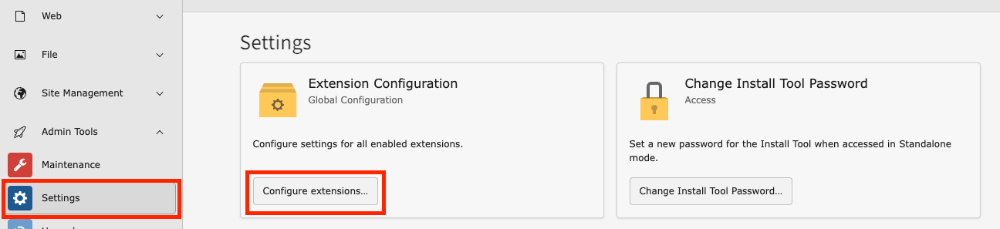
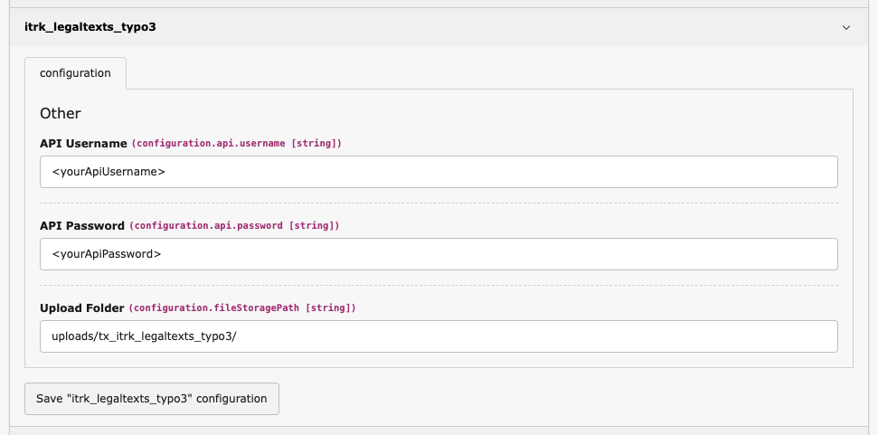
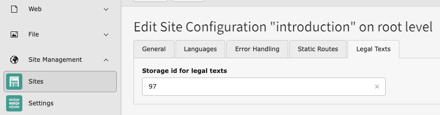
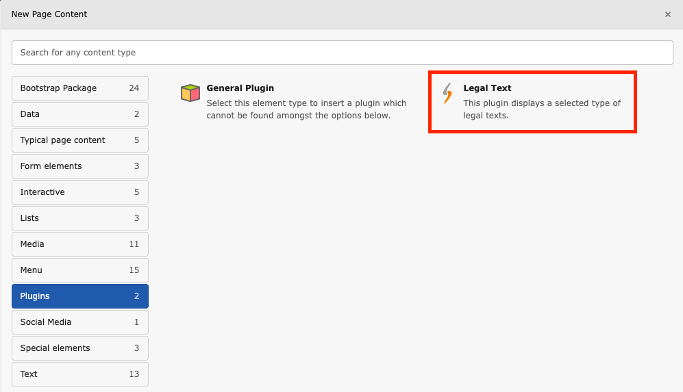

# IT-Recht Kanzlei - Legal Texts

This extension allows you to easily integrate legal texts into your TYPO3 site.

The texts are provided through IT-Recht Kanzlei. An active subscription is required to utilize this feature.

## Installation

1. Install the extension. ```composer require it-recht-kanzlei/itrk-legaltexts-typo3```
2. [Include the `itrk_legaltexts_typo3` TypoScript.](Resources/Private/Documentation/typoscript.png)
3. [Insert "Legal Text" frontend plugin on the relevant pages.](Resources/Private/Documentation/typoscript.png)

## Configuration

### API and upload folder

In the Extension Configuration, the API credentials must be configured.

Please choose a secure password that has never been used before.

| Name              | Key             | Description                                  |
|-------------------|-----------------|----------------------------------------------|
| **API Username**  | api.username    | [String] _Self-defined username for the API_ |
| **API Password**  | api.password    | [String] _Self-defined password for the API_ |
| **Upload Folder** | fileStoragePath | [String] _Storage path for the pdfs_         |

Open the Extension Configuration



Configure the API Username and Password



### Legal texts storage id

For each site configuration, a dedicated folder must be configured where the legal texts will be stored.

| Name                       | Key                  | Description                           |
|----------------------------|----------------------|---------------------------------------|
| **Legal Text Storage Id**  | itrkLegalTextStorage | [String] _Storage id for legal texts_ |



## Usage

### Plugin

Place the *Legal Text* plugin on the desired page and configure which document type should be displayed. You can
choose to display the legal text as plain text, HTML, and/or a PDF link.



There is an option to select the language directly in the plugin. This can be used if there is no legal text available
in the desired language or as a workaround for TYPO3 v10/v11 when a legal text exists without a default language version.
By default, nothing needs to be selected here.

### API

In the IT-Recht Kanzlei client portal, configure a new interface and enter your shop URL, along with the API username and
password that you set in the Extension Configuration.

